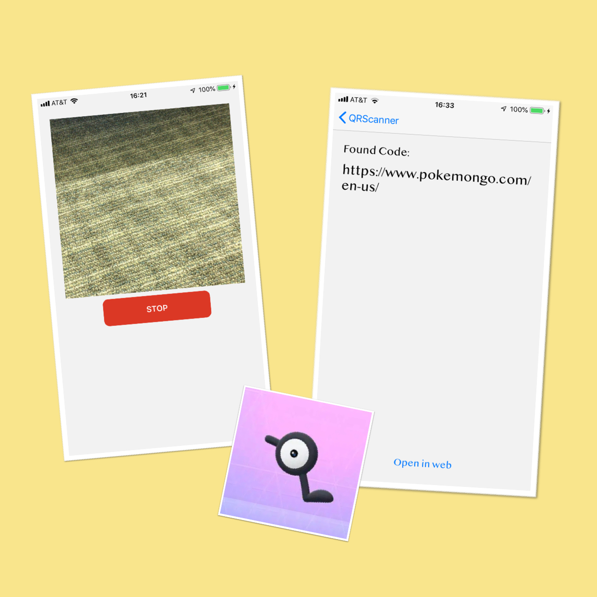

# hack-a-thing-1 UnownScanner

Hack-a-thing 1 for CS98

Qirong Li and Xinchen Zhao

### Our Project

Neither of us have any experience with Swift and iOS programming, and thought it would be cool to use a library for scanning QR codes. Therefore we decided to experiment with building an app that allows users to scan QR codes. We started by watching a [tutorial](https://www.youtube.com/watch?v=aiXvvL1wNUc) about how to build iOS apps using swift and then followed [this](https://www.appcoda.com/barcode-reader-swift/) and [this](https://medium.com/@abhimuralidharan/how-to-create-a-simple-qrcode-barcode-scanner-app-in-ios-swift-fd9970a70859) for using AVFoundation framework to implement scanning QR codes.

### How It Works

When you run the app it asks for permission to use the camera. When "stop" is pressed, the screen will stop on the current scence and not scan for QR codes. Once detected a QR code, the app jumps to a second interface that gives the result for scanning. The user also has the option to go back to the previous page or visit the link attached to the QR code through web.

### Distribution of Work

Qirong Li:

- UI framework for main page, result page,  launch screen, and logo
- scan using AVFoundation
- open detected link in web

Olivia Zhao:

- copy to clipboard logic and post a toast
- scan using AVFoundation
- return to main page from result page

### What We Learned

We learned how to build an iOS app using Swift and how to use the AVFoundation library to enable video capturing and detect QR code. We also learned about the MVC (Model, View and Controller) Architecture and the structure of mobile applications. Learning about git flow is also very helpful.

### What Didn't Work

We had a lot of trouble setting up the environment, launching the project on our phones, and getting the storyboard in place. Giving permission for camera also took a lot of time. We didn't have enought time to make our launch screen stay for a fixed amount of time. In the current version, the launch screen only shows for a short period.
